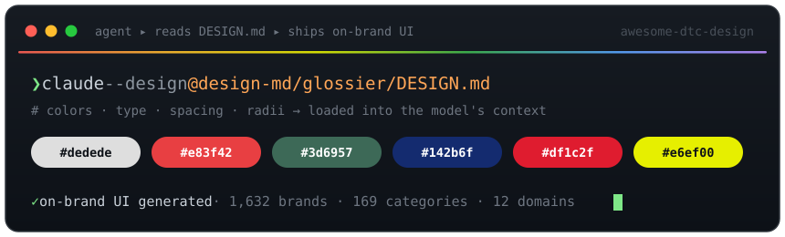

<div align="center">

# 🎨 awesome-dtc-design



### Design systems your AI agent can actually read.

**1,481 real direct-to-consumer brands** distilled into plain-text `DESIGN.md` token files — so the UI your coding agent generates looks like a *real brand*, not a bootstrap template.

[](https://awesome.re)
[](./INDEX.md)
[](./INDEX.md)
[](#-quickstart)
[](./LICENSE)
[](./CONTRIBUTING.md)
[](https://github.com/xjli360/awesome-dtc-design/stargazers)

[**Why**](#-why-this-exists) · [**See it**](#-see-it-in-action) · [**Quickstart**](#-quickstart) · [**The collection**](#-the-collection) · [**Full index →**](./INDEX.md) · [**Contribute**](./CONTRIBUTING.md)

</div>

---

## 💡 Why this exists

AI coding agents are great at *structure* and bad at *taste*. Ask one for a landing page and you get the same rounded-blue-button, Inter-on-white, faintly-gray template every time — because that's the statistical average of everything it has ever seen.

A `DESIGN.md` fixes that. It's a single plain-text file that captures **one real brand's exact visual language** — its palette, type scale, spacing, radii, and component patterns — the specific decisions that make Glossier look like Glossier and Aesop look like Aesop. Drop it into your agent's context and the UI it produces inherits that whole system, token for token.

> **This repo is 1,481 of them**, extracted from live DTC storefronts across **156 product categories** — from skincare and cookware to keyboards, record stores, and pizza ovens.

**Who it's for** — design engineers prototyping on-brand UI · agencies pitching brand-faithful mockups · indie hackers who want their MVP to *not* look like an MVP · anyone building with Claude Code, Cursor, Copilot, or v0.

## 👀 See it in action

A `DESIGN.md` is human-readable and agent-readable at once. Here's a slice of [`design-md/glossier/DESIGN.md`](./design-md/glossier/DESIGN.md):

```yaml
---
name: Glossier
description: >
  A brand that lives in the gap between #dedede and #121212 — a pale, almost-warm
  gray and a near-black that together create a system of extreme restraint. The
  canvas is not white but a soft, foggy gray that reads as a studio backdrop,
  making every product the hero. Buttons are pill-shaped, cards softly rounded,
  and the whole experience breathes through generous whitespace.
---

colors:
  primary:       "#dedede"   # foggy gray — the signature "studio backdrop"
  ink:           "#121212"   # near-black, used sparingly
  canvas:        "#f5f5f5"
  accent-pink:   "#f4a2b8"

typography:
  display-xl:
    fontFamily:  "'GT America', -apple-system, sans-serif"
    fontSize:    36px
    fontWeight:  400
    lineHeight:  1.2
    letterSpacing: -0.5px

rounded:   { md: 8px, full: 9999px }   # softly-rounded cards, pill buttons
```

Hand it to your agent:

```text
Build a hero section for a face serum.
Use the attached DESIGN.md — match its colors, typography, radii, and
spacing exactly. Don't invent new colors.
```

…and the output comes back in foggy gray with pill buttons and GT America — Glossier, not Bootstrap. Every file also documents its own **Known Gaps**, so the agent knows what was *not* reliably captured.

## 🚀 Quickstart

1. **Find a brand** in [the collection](#-the-collection) or the [full index](./INDEX.md).
2. **Give the file to your agent** as context.
3. **Ask it to build** — it now has the brand's entire design system.

**Claude Code**
```bash
claude "Build a product page for a ceramic kettle using @design-md/caraway/DESIGN.md — match it exactly."
```

**Cursor / Copilot / Windsurf** — drag the `DESIGN.md` into chat (or `@`-mention it), then prompt as above.

**v0 / Lovable / bolt** — paste the file contents at the top of your prompt.

## 📐 What's inside each `DESIGN.md`

Nine sections, every file, in the same order — see the full spec in [`CONTRIBUTING.md`](./CONTRIBUTING.md).

| Section | What it captures |
|---|---|
| **Description** | A 200–400 word editorial read of the brand's design philosophy & voice |
| **`colors`** | Semantic tokens → hex: neutrals, surfaces, accents, semantic roles |
| **`typography`** | Full type scale — `fontFamily`, `fontSize`, `fontWeight`, `lineHeight`, `letterSpacing` |
| **`rounded`** | Border-radius scale (`xs`–`full`) |
| **`spacing`** | Spacing scale (`xxs`–`section`) |
| **`components`** | Buttons, cards, inputs, nav — as token references |
| **Components** *(prose)* | Each component described with its state variants |
| **Responsive Behavior** | Breakpoints, touch targets, collapse strategy |
| **Known Gaps** | What couldn't be extracted reliably — stated honestly |

## 📚 The collection

**1,481 brands · 156 categories · 12 domains.** Browse everything in **[`INDEX.md →`](./INDEX.md)**.

| Domain | Brands | Sample categories |
|---|--:|---|
| 💻 Tech & Computing | 239 | Phones & accessories · keyboards · laptops · monitors · networking |
| 📖 Books & Media | 170 | Independent bookstores · small presses · movies & TV |
| 🏠 Home & Living | 156 | Bedding · decor · furniture · vacuums · appliances |
| 🌲 Outdoor & Garden | 148 | Camping · outdoor furniture · nurseries · patio |
| 🎲 Gaming & Collectibles | 130 | Board games · tabletop RPGs · trading cards · figures |
| 💄 Beauty & Personal Care | 122 | Skincare · makeup · haircare · fragrance · grooming |
| 🎵 Music & Instruments | 109 | Record stores · labels · DJ gear · instruments |
| 🍳 Kitchen & Cookware | 98 | Cookware · kitchen tools · espresso · grills |
| ✒️ Stationery & Desk | 95 | Notebooks · pens · desk organizers · paper goods |
| 🍼 Baby & Kids | 82 | Baby care · clothing · STEM · educational |
| 🏃 Sport & Fitness | 70 | Cycling · running · yoga · gym |
| 🌿 Health & Wellness | 62 | Supplements · women's & men's health |

### ⭐ Featured brands

A few you'll recognize — each links to its full spec:

| Brand | Design signature |
|---|---|
| [**Glossier**](./design-md/glossier/DESIGN.md) | Foggy-gray studio canvas, near-black ink, pill buttons — extreme restraint |
| [**Aesop**](./design-md/aesop/DESIGN.md) | Deliberate restraint; texture, weight, and quiet typographic authority |
| [**The Ordinary**](./design-md/ordinary/DESIGN.md) | Stark white canvas, one clinical red (`#e83f42`) as the only release |
| [**Drunk Elephant**](./design-md/drunk-elephant/DESIGN.md) | Clinical apothecary crossed with a colorful candy shop |
| [**Fenty Beauty**](./design-md/fenty-beauty/DESIGN.md) | Inclusive, high-contrast, sculptural — rewrote the category's palette |
| [**Caraway**](./design-md/caraway/DESIGN.md) | Warm, design-led ceramic cookware that belongs on the counter |
| [**Our Place**](./design-md/our-place/DESIGN.md) | The shared table as the brand's whole thesis |
| [**Hexclad**](./design-md/hexclad/DESIGN.md) | Steel-meets-nonstick hybrid tension, made visual |
| [**Made In**](./design-md/made-in/DESIGN.md) | Rugged utility balanced with restrained elegance |
| [**Parachute**](./design-md/parachute/DESIGN.md) | Whispers of linen and stone — warm, tactile home |
| [**Brooklinen**](./design-md/brooklinen/DESIGN.md) | Premium-casual voice on a deep-navy anchor and off-white canvas |
| [**Casper**](./design-md/casper/DESIGN.md) | Trustworthy sleep-first blues with accent-driven energy |
| [**Hay**](./design-md/hay/DESIGN.md) | Danish: soft contrasts, muted earth tones, material honesty |
| [**Blueland**](./design-md/blueland/DESIGN.md) | A color-coded refill system — yellow citrus, mint eucalyptus |
| [**Ritual**](./design-md/ritual/DESIGN.md) | A single deep navy (`#142b6f`) carried as the entire identity |
| [**Hims**](./design-md/hims/DESIGN.md) | Apothecary sage green instead of clinical telehealth blue |
| [**Peloton**](./design-md/peloton/DESIGN.md) | Near-black canvas with a single red voltage (`#df1c2f`) |
| [**Dyson**](./design-md/dyson/DESIGN.md) | FoundryGridnik industrial sans — product-grade authority, on screen |

**→ [Browse all 1,481 brands in `INDEX.md`](./INDEX.md)**

## 🛠️ How it's made

Every spec is produced by an automated, resumable pipeline ([`scripts/`](./scripts)):

1. **Crawl** the live storefront and extract real CSS — color values, font stacks, radii, spacing.
2. **Filter** framework defaults (Bootstrap / Tailwind reset palettes) so the model locks onto the brand's *actual* colors, not the CSS boilerplate.
3. **Generate** a 9-section `DESIGN.md` with Claude — tokens plus an editorial read of the brand's voice.
4. **Validate** structure against the schema in [`CONTRIBUTING.md`](./CONTRIBUTING.md).

These are best-effort extractions of public, observable design decisions — each file states its own **Known Gaps**. Provenance (slug, category, source URL) for every brand lives in [`data/brands.csv`](./data/brands.csv).

## 🤝 Contributing

PRs welcome — one brand per PR. Pick a genuinely DTC brand, add `design-md/<slug>/DESIGN.md` following the nine-section spec, and open a PR. Full guidelines in [`CONTRIBUTING.md`](./CONTRIBUTING.md).

## 🔗 Related

- [`awesome-design-md`](https://github.com/VoltAgent/awesome-design-md) — the original `DESIGN.md` format and spec this project follows.

## 📄 License

[MIT](./LICENSE) — design tokens describe publicly observable facts about brand interfaces; all trademarks belong to their respective owners.

<div align="center">

---

**If this helps your agent build better UI, leave a ⭐ — it genuinely helps.**

</div>
